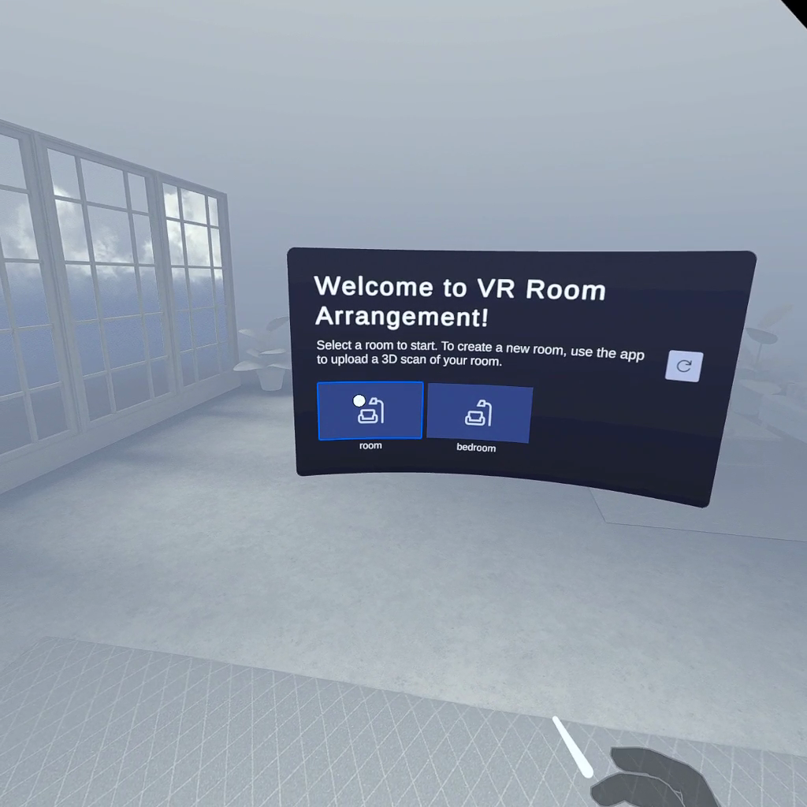
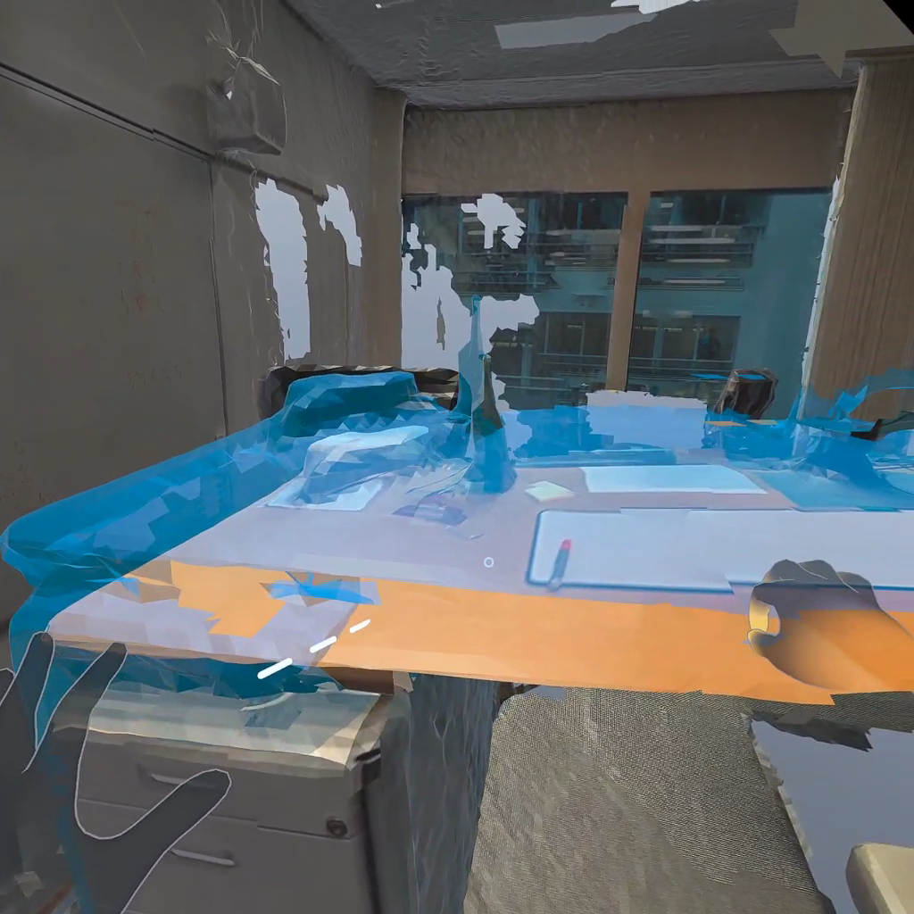
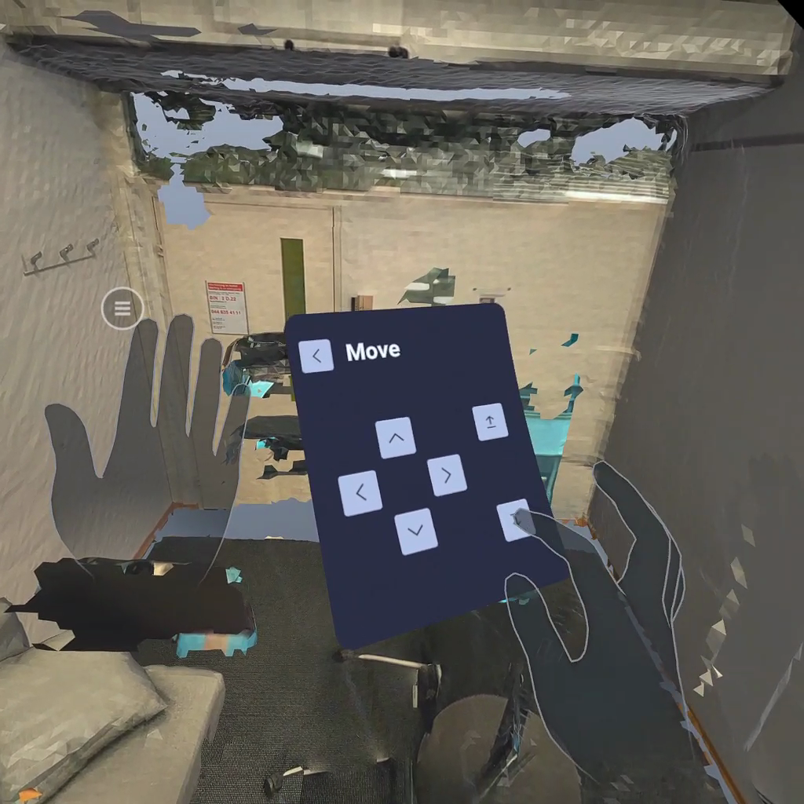
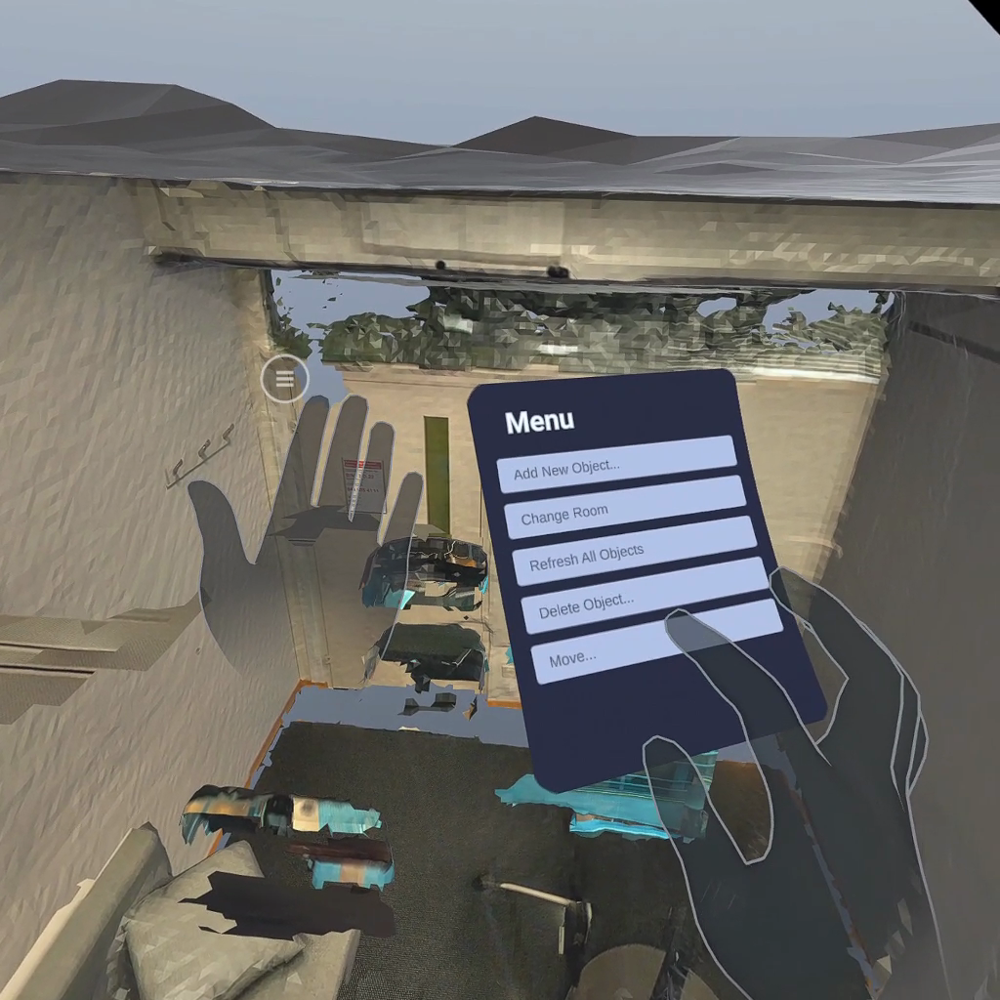
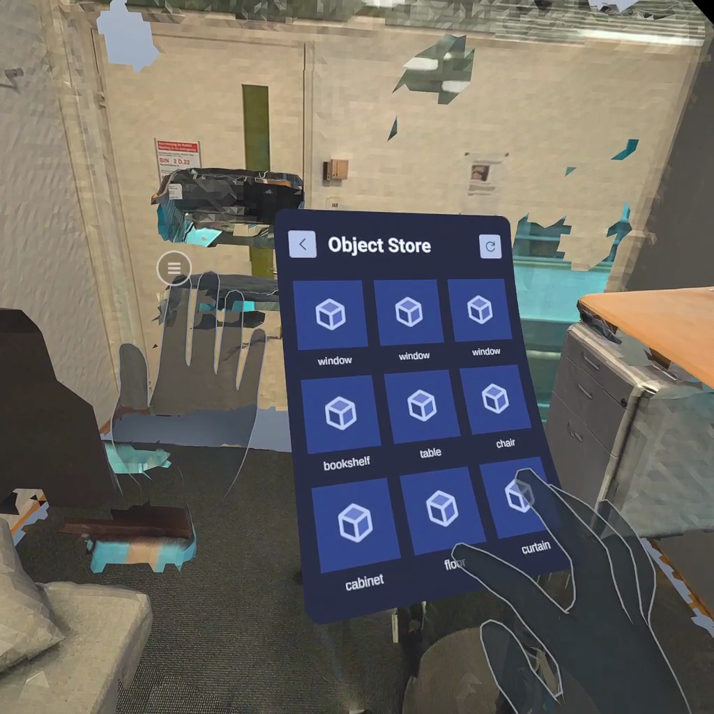
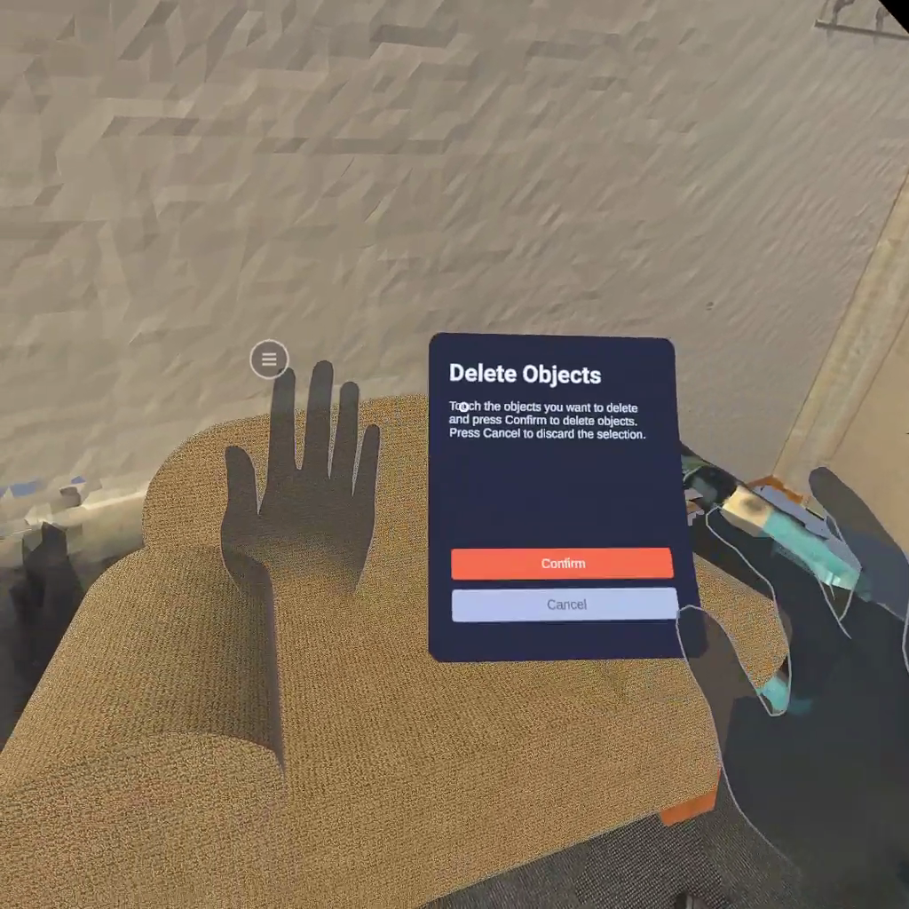

# VR Client of 3D Room Arrangements System

Welcome to the repository of the VR client of the project ["3D Room Arrangements using Virtual Reality"](https://github.com/MixedRealityETHZ/3d-vr-room-arrangements). The VR client is built with Unity and Oculus Integration SDK. It allows multiple users to rearrange objects in a virtual room using gestures, add new objects from CAD model datasets, and remove unwanted objects. All objects are fetched from the backend server and synchronized with the server in real-time.

---

## Build

The project is built with Unity 2021.3.11f1. To build the native Android app, Android Build Support module, Android Software Development Kit (SDK) and Native Development Kit (NDK), and OpenJDK must be installed according to [the documentation of Quest](https://developer.oculus.com/documentation/unity/book-unity-gsg/#install-unity-editor).

After setting up the environment, the [Oculus Integration SDK](https://developer.oculus.com/documentation/unity/unity-import/#import-sdk-from-unity-asset-store) must be installed and imported from Unity Asset Store or Oculus Developer Center.

Then to build the project, open the project in Unity and click on `File > Build Settings...`. Select the platform you want to build for (Android or Windows) and click on `Build`.

## Run

### Run on Oculus Quest

To run the app on Oculus Quest, the app must be built for Android and then installed on the device. The headset should be set into developer mode and connected to the computer with a USB cable. The app can be installed directly in Unity or with the `adb` command line tool. See [the documentation of Quest](https://developer.oculus.com/documentation/unity/unity-enable-device/) for more details.

### Run on Windows through Oculus Link

The app can also be run on a Windows PC through Oculus Link. To do so, the app must be built for Windows and added to the library of the Oculus PC app. The "Developer Runtime Features" and "Passthrough over Oculus Link" must be enabled in the Beta tab of Settings in the Oculus PC app.